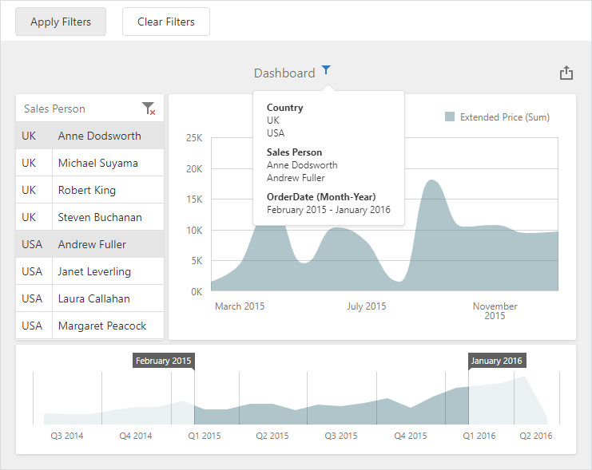

<!-- default badges list -->

<!-- default badges end -->

# Dashboard for Web Forms - How to Apply Master Filter on the Client
<!-- run online -->
**[[Run Online]](https://codecentral.devexpress.com/128579785/)**
<!-- run online end -->

This example shows how to apply a master filter in the Web Dashboard on the client.

- The [ViewerApiExtension.setMasterFilter](https://docs.devexpress.com/Dashboard/js-DevExpress.Dashboard.ViewerApiExtension?p=netframework#js_devexpress_dashboard_viewerapiextension_setmasterfilter_itemname_values_) method call applies the Master Filter values to the Grid item.
- The [ViewerApiExtension.setRange](https://docs.devexpress.com/Dashboard/js-DevExpress.Dashboard.ViewerApiExtension#js_devexpress_dashboard_viewerapiextension_setrange_itemname_range_) method call applies the range to the Range Filter item.

The [dxButton](https://js.devexpress.com/DevExtreme/ApiReference/UI_Components/dxButton/)'s `onClick` event handler calls these methods.

## Files to Review

* [MasterFiltering.js](./CS/WebDashboard_SetMasterFilter/Scripts/MasterFiltering.js) (VB: [MasterFiltering.js](./VB/WebDashboard_SetMasterFilter/Scripts/MasterFiltering.js))
* [Default.aspx](./CS/WebDashboard_SetMasterFilter/Default.aspx) (VB: [WebForm1.aspx](./VB/WebDashboard_SetMasterFilter/Default.aspx))
* [Default.aspx.cs](./CS/WebDashboard_SetMasterFilter/Default.aspx.cs) (VB: [WebForm1.aspx.vb](./VB/WebDashboard_SetMasterFilter/Default.aspx.vb))

## Documentation

- [Interactivity in the Web Dashboard](https://docs.devexpress.com/Dashboard/116985/web-dashboard/create-dashboards-on-the-web/interactivity?p=netframework)

## More Examples

- [Dashboard for MVC - How to Apply Master Filter on the Client](https://github.com/DevExpress-Examples/mvc-dashboard-apply-master-filtering-in-code)
